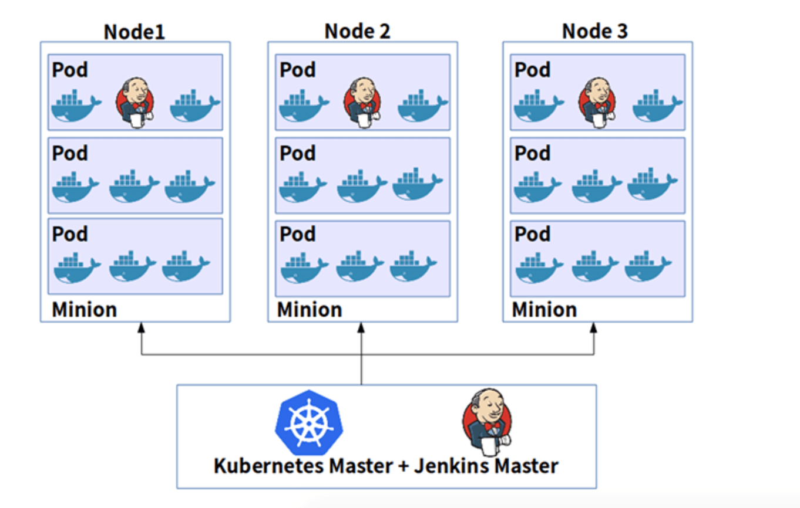

# ⚙️ Module 3: Jenkins Architecture

## 🎯 Objective
Understand the core architecture of Jenkins, how it distributes workloads, and how it scales using Docker, VMs, and Kubernetes.

---

## 🧱 Core Components

### 🧠 Controller (Master)
- The brain of Jenkins.
- Manages:
  - The web UI
  - Scheduling jobs
  - Queueing builds
  - Dispatching to agents
  - Managing plugins and configuration

> **Note:** In modern Jenkins terms, “Controller” is used instead of “Master”.

---

### 🛠️ Agent (Worker/Node)
- Executes build steps (e.g., shell scripts, Docker builds, Python tests).
- Can run:
  - On the same machine as the controller (not recommended)
  - On a separate physical or virtual machine
  - Inside a Docker container
  - Inside a Kubernetes pod

---

### 🔌 Plugins
- Jenkins is extremely modular.
- Most integrations (GitHub, Slack, Docker, AWS, Kubernetes, etc.) are provided via plugins.

---

## 🖼️ Diagram: Basic Jenkins Architecture


---

## ⚡ How Jenkins Runs Builds (Common Setups)

### 1️⃣ On the Controller (not recommended for production)
- Simple setup.
- Not scalable or secure.
- All jobs compete for the same CPU/RAM.

### 2️⃣ With Static Agents (VMs or physical machines)
- Agents installed manually.
- Good for consistent environments.
- Better resource isolation.

---

## 🖼️ Diagram: Jenkins with Static agents




---

### 3️⃣ With Docker Agents
- Jenkins launches containers on demand.
- Clean build environment every time.
- Example: run a Python test suite inside a `python:3.11` image.

```groovy
pipeline {
  agent {
    docker {
      image 'python:3.11'
    }
  }
  stages {
    stage('Test') {
      steps {
        sh 'pytest tests/'
      }
    }
  }
}
```

### 4️⃣ With Kubernetes Agents (Best for scalability)

- Jenkins dynamically creates pods per build using the **Kubernetes plugin**.
- Works great for CI/CD at scale (e.g., microservices or data pipelines).
- Each pod can have a different toolset (Python, Spark, dbt, etc.).

---

## 🖼️ Diagram: Jenkins with Kubernetes Agents


---

## ✅ Summary

| Setup             | Pros                          | Cons                                |
|------------------|-------------------------------|-------------------------------------|
| On Controller     | Simple, quick to start         | Not scalable or secure              |
| Static Agents     | Stable, predictable            | Manual provisioning, less flexible  |
| Docker Agents     | Isolated, reproducible builds  | Requires Docker on host             |
| Kubernetes Agents | Auto-scaled, cloud-native      | Needs Kubernetes expertise and setup |

---

> Jenkins can run **anywhere**—a local VM, Docker container, EC2 instance, or a Kubernetes cluster. Choose based on team size, scale, and workflow complexity.


